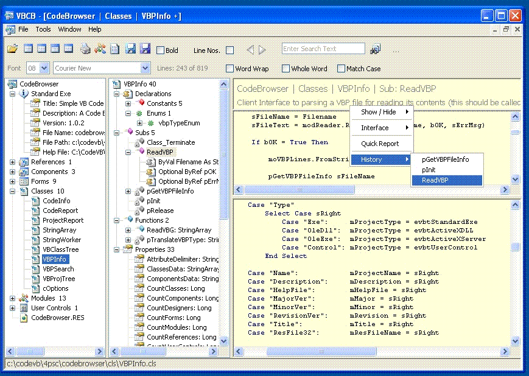



## VB Code Browser for VB5 & VB6: \(R8, Feb 2012\)

### Description

Reads VB5/6 Projects and Source Files. Project Explorer, Class Explorer, Project Search, Members List, Copy Method, Copy Project, Unzip Project, Scan for local PSC ReadMe Files, Members to HTML, References, Export Code to RTF or HTML, basic Colour Printing, and, more.

Unzip requires Unzip32.dll from Info-Zip (links for download on Options page). Many thanks to Rohan for showing me how to unzip to memory with ZipSearch and other fabulous things.

I am releasing this having added a few more things and finding it indeispensible. My updates have focused on growing functionality and, subsequently, the project has become an R & D scoping exercise (son of code browser is in progress). Not unicode aware. I still gotta use VB6 so this is writen to serve my own practical needs. Zip size 613k, help file included. happy coding people
 
### More Info
 

             |
---                |---
**Submitted On**   |2012-02-10 07:42:34
**By**             |[Dave Carter](https://github.com/Planet-Source-Code/PSCIndex/blob/master/ByAuthor/dave-carter.md)
**Level**          |Intermediate
**User Rating**    |5.0 (100 globes from 20 users)
**Compatibility**  |VB 5\.0, VB 6\.0, VB Script
**Category**       |[Complete Applications](https://github.com/Planet-Source-Code/PSCIndex/blob/master/ByCategory/complete-applications__1-27.md)
**World**          |[Visual Basic](https://github.com/Planet-Source-Code/PSCIndex/blob/master/ByWorld/visual-basic.md)
**Archive File**   |[VB\_Code\_Br2219892152012\.zip](https://github.com/Planet-Source-Code/dave-carter-vb-code-browser-for-vb5-vb6-r8-feb-2012__1-73521/archive/master.zip)

